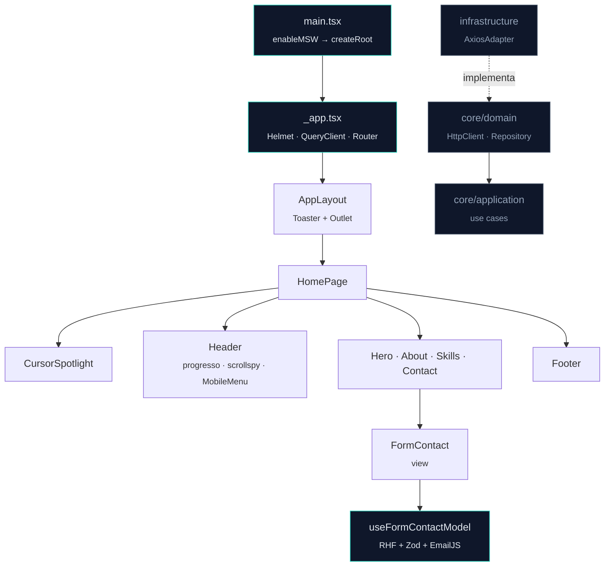

<div align="center">

# João Vittor<span>.</span>

**Portfólio pessoal — uma página, quatro seções, zero enfeite gratuito.**

Uma SPA em React + TypeScript construída como se fosse produto: tipada de ponta a ponta,
testada em duas camadas e com as decisões de interface documentadas no próprio código.

[](https://react.dev)
[](https://www.typescriptlang.org)
[](https://vite.dev)
[](https://tailwindcss.com)
[](https://vitest.dev)
[](https://playwright.dev)

[**Ver ao vivo →**](https://vittordev.com.br)

</div>

---

## Índice

- [Sobre](#sobre)
- [O que tem de interessante aqui](#o-que-tem-de-interessante-aqui)
- [Stack](#stack)
- [Arquitetura](#arquitetura)
- [Estrutura de pastas](#estrutura-de-pastas)
- [Rodando localmente](#rodando-localmente)
- [Variáveis de ambiente](#variáveis-de-ambiente)
- [Scripts](#scripts)
- [Testes](#testes)
- [Integração contínua](#integração-contínua)
- [Design system](#design-system)
- [Acessibilidade](#acessibilidade)
- [Roadmap](#roadmap)
- [Contato](#contato)

---

## Sobre

Portfólio de **João Vittor Lopes dos Santos** — analista de dados e desenvolvedor front-end.

É uma *single-page application* com navegação por âncora e scrollspy: `Início → Sobre → Habilidades → Contato`.
O formulário de contato dispara e-mail real via EmailJS, com validação no cliente por Zod e feedback por toast.

O que diferencia este repositório de um portfólio de template não é a quantidade de features — é a densidade
de decisão por linha. Cada correção de comportamento em mobile, cada workaround de iOS e cada escolha de
tipografia está comentada no ponto onde importa, e coberta por um teste que falha se alguém desfizer.

**Números do projeto:** ~4.300 linhas entre `src/` e `test/` · 118 testes automatizados · 2 workflows de CI.

---

## O que tem de interessante aqui

Os problemas abaixo não aparecem no *happy path* do desktop. Todos foram encontrados em dispositivo real,
corrigidos e depois travados por teste E2E.

<table>
<tr><td width="34%"><strong>Trava de scroll que o iOS respeita</strong></td>
<td><code>overflow: hidden</code> no <code>body</code> é ignorado pelo Safari iOS — a página segue rolando atrás do
overlay. A solução fixa o <code>body</code> na posição atual, compensa a largura da scrollbar no desktop e
devolve o scroll exato ao fechar. Roda como <em>layout effect</em> para que o destravamento seja síncrono.
<br><sub><a href="src/shared/hooks/use-scroll-lock.ts">use-scroll-lock.ts</a></sub></td></tr>

<tr><td><strong>Menu mobile em portal, por necessidade</strong></td>
<td>O header aplica <code>backdrop-filter</code> ao rolar — e um ancestral com <code>backdrop-filter</code>
passa a ser o <em>containing block</em> dos descendentes <code>position: fixed</code>. O overlay
<code>inset-0</code> encolhia para a caixa do header em vez de cobrir a viewport. Renderizar em
<code>document.body</code> via portal é o que resolve.
<br><sub><a href="src/features/home/components/mobile-menu.tsx">mobile-menu.tsx</a></sub></td></tr>

<tr><td><strong>Navegação em duas fases</strong></td>
<td>Clicar num link do menu não pode rolar imediatamente: a trava de scroll engoliria o salto para a âncora.
O menu sinaliza o destino, fecha, e só depois o pai navega — coordenado por <code>useRef</code> +
<code>useEffect</code>, respeitando <code>prefers-reduced-motion</code>.
<br><sub><a href="src/features/home/components/header.tsx">header.tsx</a></sub></td></tr>

<tr><td><strong>Hover que não fica preso no toque</strong></td>
<td><code>hoverOnlyWhenSupported</code> envolve todo <code>hover:</code> em <code>@media (hover: hover)</code>.
Sem isso, um toque no mobile deixa o estado de hover grudado no elemento.
<br><sub><a href="tailwind.config.js">tailwind.config.js</a></sub></td></tr>

<tr><td><strong><code>min-h-svh</code> em vez de <code>100vh</code></strong></td>
<td>No iOS a barra de endereço entra na conta de <code>vh</code>: o conteúdo é cortado e a altura "salta"
ao rolar. Somado a <code>viewport-fit=cover</code> + <code>env(safe-area-inset-*)</code>, o layout respeita
notch e barra de gestos.
<br><sub><a href="src/features/home/components/hero.tsx">hero.tsx</a></sub></td></tr>

<tr><td><strong>Zoom automático de input, resolvido</strong></td>
<td>Campos com fonte menor que 16px fazem o iOS dar zoom ao focar e torcem o layout. Os inputs usam
<code>text-base</code> no mobile e <code>text-sm</code> só a partir do <code>md</code>, com altura de 44px
(alvo de toque WCAG 2.5.8).
<br><sub><a href="src/shared/components/ui/input.tsx">input.tsx</a></sub></td></tr>

<tr><td><strong>Cascata com teto</strong></td>
<td>A lista de habilidades tem 33 tags. Com atraso linear, a animação em cascata passava de 1s e parecia
travamento no mobile — o atraso é limitado a <code>min(index, 10) × 30ms</code>.
<br><sub><a href="src/features/home/components/skills.tsx">skills.tsx</a></sub></td></tr>

<tr><td><strong>Movimento é opcional</strong></td>
<td><code>prefers-reduced-motion</code> é honrado em três níveis: o <code>useReveal</code> revela na hora sem
observar, o spotlight do cursor nem inicializa, e um bloco CSS zera transições e animações residuais.
<br><sub><a href="src/shared/styles/index.css">index.css</a></sub></td></tr>
</table>

---

## Stack

| Camada | Escolha | Por quê |
|---|---|---|
| **Build** | Vite 5 + plugin React | HMR instantâneo; `tsc -b` no build barra erro de tipo antes do bundle |
| **UI** | React 18 · TypeScript 5.7 (`strict`) | `noUnusedLocals` e `noUnusedParameters` ligados — o compilador é o primeiro revisor |
| **Estilo** | Tailwind CSS 3.4 + `tailwindcss-animate` | Acento único centralizado; trocar a identidade é editar um objeto |
| **Componentes** | shadcn/ui (New York) sobre Radix UI | Primitivas acessíveis, código no repositório em vez de dependência opaca |
| **Variantes** | `class-variance-authority` · `tailwind-merge` · `clsx` | Um `cn()` resolve conflito de classe sem `!important` |
| **Formulário** | React Hook Form + Zod (`@hookform/resolvers`) | Schema é a fonte da verdade: valida e infere o tipo do formulário |
| **E-mail** | EmailJS | Contato funcional sem manter backend |
| **Rotas** | React Router 6 (`createBrowserRouter`) | Layout compartilhado via `<Outlet />`, pronto para novas páginas |
| **Dados** | TanStack Query 5 | Client configurado (sem refetch no foco, sem retry) para consumo futuro de API |
| **HTTP** | Axios encapsulado em adapter | A aplicação depende da interface `HttpClient`, não do Axios |
| **SEO** | `react-helmet-async` | `titleTemplate` + Open Graph e Twitter Card no `index.html` |
| **Feedback** | Sonner | Toasts em tema dark, montados no layout raiz |
| **Ícones** | Lucide React | SVG tree-shakeable, tamanho por prop |
| **Mocks** | MSW 2 | Service worker ativo só em `development` — em `test` cederia a interceptação ao Playwright |
| **Testes** | Vitest + Testing Library + happy-dom · Playwright | Unidade para comportamento de componente, E2E para geometria e navegação real |
| **Padrão** | ESLint (`@rocketseat/eslint-config`) · `simple-import-sort` · Prettier + plugin Tailwind | Ordem de import e de classe são automáticas, não opinião de PR |
| **Pacotes** | pnpm 11.17 (fixado em `packageManager`) | CI e local resolvem exatamente a mesma árvore |

---

## Arquitetura

Duas organizações convivem de propósito: **feature-first** para o que está na tela e
**clean architecture** para o acesso a dados.



**Três padrões que estruturam o código:**

1. **MVVM no formulário** — `form-contact/index.tsx` é só marcação; `form-contact-model.ts` concentra
   estado, validação e envio; `form-contact.schema.ts` é a única definição de regra. A view não sabe que
   EmailJS existe.

2. **Adapter na fronteira de rede** — `AxiosAdapter` implementa `HttpClient` (`core/domain/entities`).
   Trocar Axios por `fetch` é escrever um segundo adapter; nenhum caso de uso muda.

3. **Lógica de interface em hooks** — `useReveal` (revelação no scroll), `useActiveSection` (scrollspy por
   `IntersectionObserver`), `useMediaQuery` (breakpoint reativo em JS) e `useScrollLock` (trava de scroll).
   Cada um é testado isoladamente, sem componente.

> **Nota honesta:** as camadas `core/` e `infrastructure/` são um esqueleto preparado, ainda não conectado a
> nenhuma feature — este portfólio não consome API. Ficam versionadas porque definem o contrato para o
> primeiro endpoint real, e estão excluídas do relatório de cobertura justamente por isso.

---

## Estrutura de pastas

```
portfolio/
├── .github/workflows/playwright.yml   # CI: unit + e2e em paralelo
├── public/                            # favicon, service worker do MSW
├── src/
│   ├── main.tsx                       # bootstrap (aguarda o MSW antes de montar)
│   ├── _app.tsx                       # providers globais
│   ├── env.ts                         # env validado por Zod — quebra no boot, não em runtime
│   │
│   ├── core/                          # ── domínio, sem dependência de framework
│   │   ├── domain/entities/           #    HttpClient, HttpRequest, HttpResponse
│   │   ├── domain/repositories/       #    contratos de repositório
│   │   └── application/               #    casos de uso · setup do MSW
│   │
│   ├── infrastructure/                # ── implementações concretas
│   │   ├── http/axios-adapters.ts     #    AxiosAdapter com interceptors
│   │   └── repositories/              #    repositório sobre HttpClient
│   │
│   ├── features/home/                 # ── a feature
│   │   ├── pages/index.tsx            #    composição da página
│   │   └── components/                #    header · hero · about · skills · contact · footer · mobile-menu · projects
│   │
│   └── shared/                        # ── reutilizável entre features
│       ├── components/ui/             #    13 primitivas shadcn/ui
│       ├── components/                #    form-contact, project-card, nav-link, modal, cursor-spotlight…
│       ├── hooks/                     #    use-reveal · use-active-section · use-media-query · use-scroll-lock
│       ├── layouts/ · routes/         #    shell da aplicação
│       ├── lib/                       #    queryClient · cn()
│       └── styles/index.css           #    base, componentes e utilitários Tailwind
│
└── test/
    ├── unit/                          # 20 arquivos · 95 testes (Vitest)
    ├── e2e/                           #  4 arquivos · 23 testes (Playwright)
    ├── mocks/                         # IntersectionObserver e matchMedia controláveis
    └── setup.ts                       # stubs globais + cleanup por teste
```

---

## Rodando localmente

**Pré-requisitos:** Node.js LTS · pnpm 11.17+ (`corepack enable` já resolve)

```bash
# 1. Clonar
git clone https://github.com/JoaoVittorL/portfolio.git
cd portfolio

# 2. Instalar
pnpm install

# 3. Configurar o ambiente
cp .env.example .env      # Windows: copy .env.example .env

# 4. Subir
pnpm dev                  # http://localhost:5173
```

> `src/env.ts` valida as variáveis com Zod na inicialização. Se algo estiver faltando, a aplicação falha
> imediatamente com a mensagem do campo — em vez de dar `undefined` no meio de um envio de e-mail.

---

## Variáveis de ambiente

| Variável | Obrigatória | Descrição |
|---|:---:|---|
| `VITE_API_URL` | ✅ | URL base do adapter HTTP (aceita string vazia enquanto não há API) |
| `VITE_ENABLE_API_DELAY` | ✅ | `'true'` \| `'false'` — transformado em boolean pelo schema |
| `VITE_SERVICE_EMAIL` | ✅ | Service ID do EmailJS |
| `VITE_TEMPLATE_ID_EMAIL` | ✅ | Template ID do EmailJS |
| `VITE_PUBLIC_KEY_EMAIL` | ✅ | Public key do EmailJS |

`MODE` (`development` \| `production` \| `test`) vem do próprio Vite e também é validado.

`.env.test` está versionado com valores fake de propósito: nos E2E a rede é interceptada e nenhum e-mail sai.

---

## Scripts

| Comando | O que faz |
|---|---|
| `pnpm dev` | Servidor de desenvolvimento com MSW ativo |
| `pnpm dev:test` | Modo `test` na porta `50789` — é o que o Playwright sobe |
| `pnpm build` | `tsc -b` (checagem de tipos) seguido de `vite build` |
| `pnpm preview` | Serve o build de produção localmente |
| `pnpm lint` | ESLint em todo o projeto |
| `pnpm test` | Suíte unitária, uma passada |
| `pnpm test:watch` | Suíte unitária em watch |
| `pnpm test:coverage` | Cobertura V8, relatório em texto e HTML |
| `pnpm test:e2e` | Playwright (sobe o servidor sozinho) |

---

## Testes

**118 testes automatizados**, divididos por aquilo que cada ferramenta faz bem.

### Unidade — 95 testes, 20 arquivos (Vitest + Testing Library + happy-dom)

Cobrem as seis seções da página, as primitivas de UI, o schema do formulário e os hooks isolados.
O `test/setup.ts` injeta antes de cada teste um `IntersectionObserver` controlável — com
`trigger()` e `triggerWith()` para simular interseção — e um `matchMedia` com registro de listeners,
o que permite **mudar o breakpoint depois da renderização** e verificar a reação (é assim que se testa
"girar o celular para landscape fecha o menu").

### E2E — 23 testes, 4 arquivos (Playwright · Chromium)

Aqui ficam as asserções que só fazem sentido num navegador de verdade — geometria, scroll e foco:

| Spec | Cobre |
|---|---|
| `home.e2e-spec.ts` | Título, badge de disponibilidade, seções visíveis, animação de entrada, CTA |
| `navigation.e2e-spec.ts` | Scrollspy, header com blur, menu de tela cheia, trava de scroll, `Escape`, restauração da posição, ausência de scroll horizontal |
| `skills.e2e-spec.ts` | Filtro por categoria e volta para "Tudo" |
| `contact.e2e-spec.ts` | Erros de validação, envio com sucesso e falha de API (ambos com rede interceptada), links diretos |

Falha em E2E gera **trace na primeira retentativa** e **screenshot**, publicados como artefato de CI por 30 dias.

```bash
pnpm test              # unidade
pnpm test:coverage     # + relatório de cobertura
pnpm test:e2e          # E2E (sobe o dev server automaticamente)
```

---

## Integração contínua

Dois jobs paralelos em `push` e `pull_request` para `main`/`master`:

```
┌─ Testes unitários (Vitest) ────────────┐   ┌─ Testes E2E (Playwright) ──────────┐
│ install → pnpm build → pnpm test       │   │ install → chromium → playwright    │
│ (o build faz a checagem de tipos)      │   │ + upload do relatório (30 dias)    │
└────────────────────────────────────────┘   └────────────────────────────────────┘
```

Dois detalhes que custaram build vermelho e ficaram documentados no workflow:

- **`pnpm/action-setup` sem `version`** — a action lê `packageManager` do `package.json`, então CI e máquina
  local usam a mesma pnpm. Com versão flutuante o CI quebrou sozinho quando o pnpm 11.17 passou a falhar em
  builds ignorados.
- **`allowBuilds` no `pnpm-workspace.yaml`** — o pnpm 11 não roda script de dependência sem aprovação
  explícita, e o esbuild precisa do seu para linkar o binário da plataforma. A chave antiga
  (`onlyBuiltDependencies`) é ignorada em silêncio pelo pnpm 11, que então derruba o install.
- **Reporter `github` no Playwright** — publica cada falha como annotation com arquivo, linha e mensagem.
  Sem ele o GitHub mostra apenas `Process completed with exit code 1`.

---

## Design system

Dark-first, um único acento, tipografia com três papéis.

```
Fundo      slate-950  #020617        Acento    accent-400  #2DD4BF  (teal)
Superfície slate-900/40 + borda 800  Hover     accent-300  #5EEAD4
Texto      slate-400 → slate-200     Foco      ring accent-400/60
```

| Fonte | Papel |
|---|---|
| **Inter** | Corpo — neutra e legível |
| **Space Grotesk** | Títulos (`h1`–`h4`) — quebra o "Inter em tudo" |
| **JetBrains Mono** | Rótulos, números de seção e tags — dá voz técnica |

A paleta de acento inteira vive em um objeto no `tailwind.config.js`: **trocar a identidade visual do site é
editar dez valores hexadecimais**, sem varredura de classes.

**Assinaturas visuais:** grid técnico com máscara radial no hero e no menu · números-fantasma editoriais
(`01`, `02`, `03`) atrás dos títulos, ocultos no mobile onde viravam ruído · spotlight teal seguindo o cursor
(desktop apenas, `requestAnimationFrame`) · barra de progresso de leitura de 1px no header · revelação por
scroll com atraso escalonado via variável CSS `--reveal-delay`.

---

## Acessibilidade

Não é uma seção decorativa — cada item abaixo tem implementação verificável no código:

- **Foco cativo no menu mobile** — `role="dialog"`, `aria-modal`, ciclo de `Tab` que inclui o botão do header
  (única forma de fechar pelo teclado), `Escape` para sair e devolução do foco ao elemento anterior.
- **Estado fora da árvore** — o menu fechado usa `invisible`, não só `opacity-0`: os links saem da ordem de
  tabulação e da árvore de acessibilidade.
- **Alvos de toque de 44px** — botões, inputs e links de navegação (WCAG 2.5.8 AAA / Apple HIG).
- **Semântica de navegação** — `aria-current` na seção ativa, `aria-expanded`/`aria-controls` no toggle,
  `aria-label` em todo controle só-ícone, `aria-hidden` em tudo que é decoração.
- **Foco sempre visível** — `:focus-visible` global com anel de acento e offset.
- **Movimento respeitado** — `prefers-reduced-motion` desliga revelações, spotlight, flutuação e scroll suave.
- **Texto que não estoura** — `overflow-wrap: break-word` em blocos de texto; `overflow-x: hidden` no body
  como rede de segurança contra scroll lateral (e um E2E que verifica isso).

---

## Roadmap

- [ ] **Publicar a seção de projetos** — `projects.tsx`, `ProjectCard` e `TagButton` estão construídos e
      testados; o link da navegação está comentado e a seção não entra na composição da página até haver
      projetos reais para mostrar.
- [ ] **Handlers do MSW** — o worker está configurado e ativo em desenvolvimento, ainda sem rotas mockadas.
- [ ] **Conectar as camadas `core`/`infrastructure`** ao primeiro endpoint real.
- [ ] **Ampliar a matriz do Playwright** — hoje só Chromium; WebKit é o navegador onde a maioria dos bugs
      corrigidos aqui apareceu primeiro.
- [ ] **Métrica de cobertura no CI** com limite mínimo.

---

## Contato

<div align="center">

**João Vittor Lopes dos Santos** · Bahia, Brasil

[](https://vittordev.com.br)
[](https://www.linkedin.com/in/jo%C3%A3o-vittor-lopes-dos-santos-199103201)
[](https://github.com/JoaoVittorL)
[](https://wa.me/5577981314622)
[](mailto:vittorsantos234@gmail.com)

<sub>Disponível para novas oportunidades.</sub>

</div>
